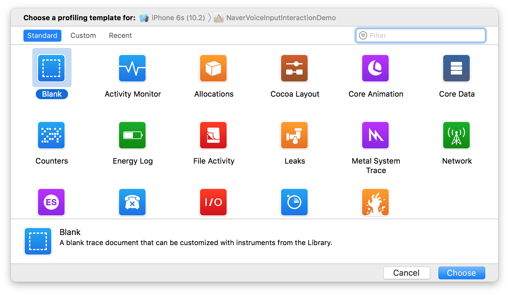
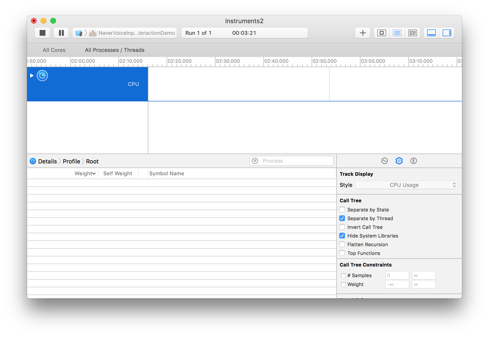
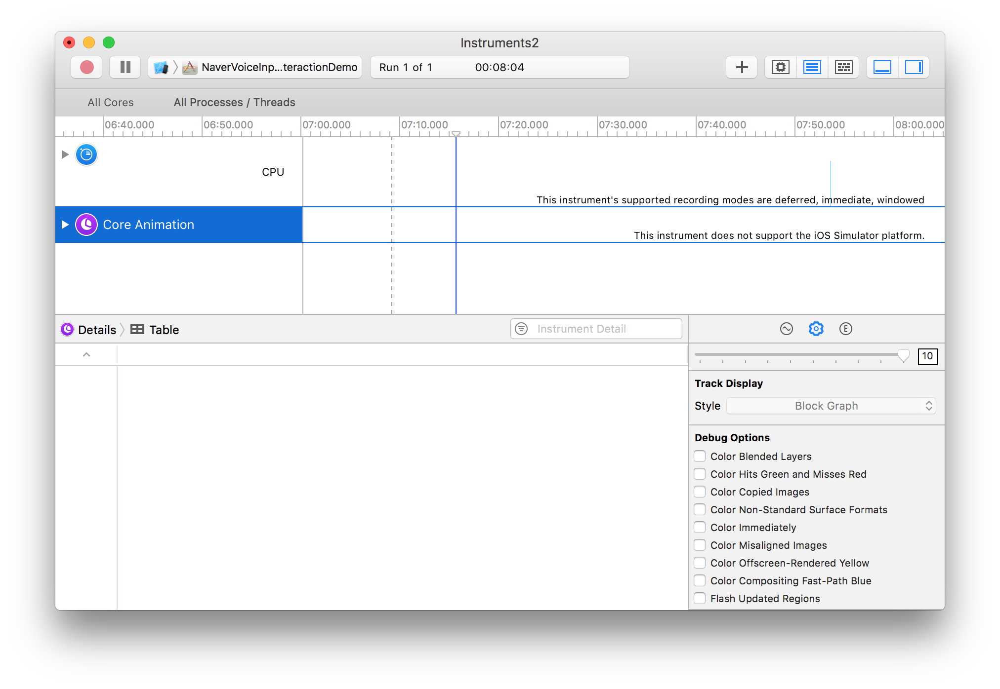
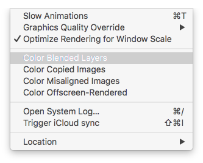
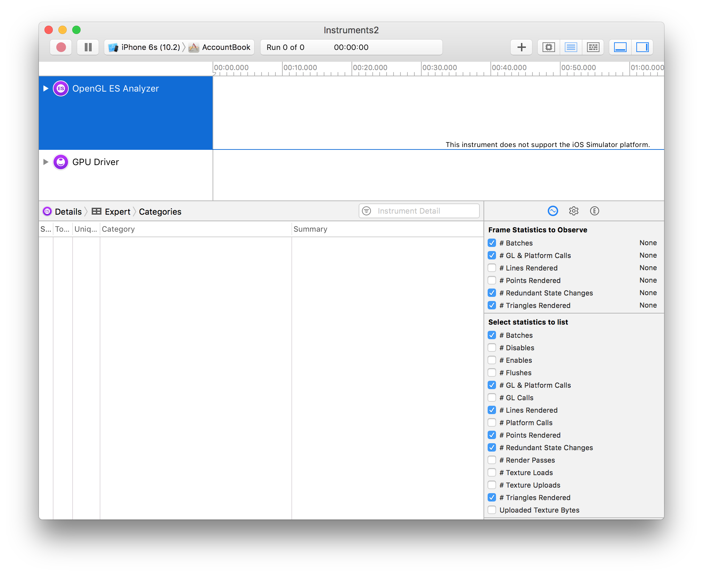

# Tuning for Speed
* Code should run as fast as necessary, but no faster. - Richard E. pattis -
* 파트 1과 파트 2에서 Core Animation이 제공해야하는 멋진 그림과 애니메이션 기능에 대해 배웠다. Core Animation은 강력하고 빠르지만 뒤에서 무슨 일이 벌어지고 있는지 명확하지 않은 경우 비효율적으로 사용하기 쉽다. 최고의 성능을 발휘하는 기술이 있다. 이 장에서는 애니메이션이 느리게 실행되는 이유와 문제를 진단하고 해결할 수 있는 몇가지 방법에 대해 살펴볼 것이다.

## CPU Versus GPU
* Drawing과 Animation에는 CPU(중앙 처리 장치)와 GPU(그래픽 처리 장치)라는 두가지 유형이 있다. 현대의 iOS 디바이스에서 이것은 임의의 소프트웨어를 실행할 수 있는 프로그램가능한 칩이지만, 역사적인 이유로 CPU에서 수행되는 작업의 일부는 "소프트웨어"로 수행되는 경항이 있으며, GPU에 의해 처리되는 부분은 "하드웨어"에서 실행된다.
* 일반적으로 말하면, 우리는 소프트웨어(CPU 사용)에서 어떠한 것이든 할 수 있지만, 그래픽 처리를 위해서는 일반적으로 GPU가 그래픽스에서 사용되는 병렬 부동 소수점 연산의 정렬에 최적화되어 있기 때문에 하드웨어를 사용하는것이 훨씬 빠르다. 이러한 이유로 가능한 많은 화면 렌더링을 하드웨어에 제공하는 것이 이상적이다. 문제는 GPU에 무제한 처리 능력이 없으며, 이미 전체 용량 사용되면 선응이 저하되기 시작한다는 것이다.(CPU가 완전히 사용되지 않더라도)
* 대부분의 애니메이션 성능 최적화는 GPU와 CPU를 지능석으로 활용하여 어느쪽도 과부화되지 않도록하는 것이다. 그러기 위해서는 Core Animation이 이러한 프로세서간에 작업을 어떻게 분할하는지 먼저 이해해야한다.

### The Stages of an Animation
* Core Animation은 iOS의 핵심이다. 단일 애니메이션은 iPad에서 제스처를 사용하여 앱을 전환할 때 두 화면을 하나의 화면에 잠깐 표시하는 등 여러 앱의 콘텐츠를 동시에 표시할 수 있다. iOS가 이러한 종류의 효과를 구현할 수 없기 때문에 특정 앱의 코드 내부에서 이 애니메이션을 수행하는 것은 의미가 없다.(앱은 샌드박스 처리되어 서로의 의견에 액세스 할 수 없다.)
* 화면에 레이어 애니메이션 및 합성은 실제로 응용 프로그램 외부의 별도 프로세스에 의해 처리된다. 이 프로세스를 렌더 서버라고한다. iOS5 이전에는 SpringBoard 프로세스(이것은 iOS 홈 화면에서도 동작함)이고, iOS 6 이후엔 BackBoard라는 새로운 프로세스에 의해 처리된다.
* 애니메이션을 수행작업은 다음과 같은 4개의 개별 단계로 나뉜다.
  * Layout - 뷰 / 레이어 계층을 준비하고 레이어 속성(프레임, 배경색, 테두리 등)을 설정하는 단계
  * Display - 레이어의 뒷면 이미지가 그려지는 곳이다. 이 그림에는 drawRect 또는 drawLayer: inContext: 메소드에 작성한 루틴이 포함될수 있다.
  * Prepare - Core Animation이 애니메이션 데이터를 렌더 서버로 보낼 준비가 되는 단계이다. 이것은 Core Animation이 애니메이션 도중 표시 될 이미지 압축 해제와 같은 다른 임무를 수행하는 지점이기도 한다.(자세한 내용은 나중에 설명)
  * Commit-Core - 애니메이션이 레이어와 애니메이션 속성을 패키지화 하고 IPC(Inter-Process Communication)를 통해 렌더링 서버로 보내어 표시하는 최종단계이다.

* 그러나 이것들은 어플리케이션 내부에서 일어나는 단계일 뿐이다. 애니메이션이 화면에 나타나기전에 해야할 일이 아직 많이 남아있다. 패키징 된 레이어와 애니메이션이 렌더 서버 프로세스에 도착했을 때 렌더 트리라고하는 다른 레이어 트리를 만들기 위해 직렬화가 해제된다.(1장 "레이어 트리" 참조) 이 트리를 사용하여 렌더링 서버는 애니메이션의 각 프레임에 대해 다음을 수행한다.
  * 모든 레이어 속성의 중간 값을 계산하고 OpenGL 지오메트리(textured triangles)를 설정하여 렌더링을 수행한다.
  * 화면에 보이는 삼각형을 렌더링한다.

* 이것까지 총 6단계 이다. 마지막 두개는 애니메이션 기간 동안 계속해서 반복된다.이 단계의 처음 다섯 단계는 소프트웨어(CPU)에 의해 처리되며, 마지막 단계는 GPU에서 처리된다. 또한 처음 두 단계(Layout and Display)를 직접 제어할 수 있다. Core Animation 프레임워크는 내부적으로 나머지를 처리하므로 사용자는 이를 제어할 수 없다.
* Layout과 Display 단계에서 어떤 작업이 CPU에서 수행되고 GPU에 무엇이 전달 될지 결정해야 하기 때문에 실제로는 문제가 아니다. 그렇다면 어떻게 이러한 결정을 내릴 수 있을까?

### GPU-Bound Operations
* GPU는 특정 작업에 최적화되어있다. 이미지 및 기하학(triangles)을 취하고, 변환을 수행하고, 텍스처링 및 블렌딩을 적용한 다음 이를 화면에 표시힌다. 최신 iOS 장치의 프로그래밍 가능한 GPU는 이러한 작업이 수행되는 방식에 많은 유연성을 허용하지만 Core Animation은 직접 인터페이스를 제공하지 않는다. Core Animation을 우회하여 자신만의 OpenGL 쉐이더를 작성하기 전에는 기본적으로 하드웨어가 가속되는 고정 된 세트로 붙어있으며 그 밖의 모든것들은 CPU의 소프트웨어로 수행되어야 한다.
* 대체로 CALayer의 대부분 속성은 GPU를 사용하여 그려진다. 예를들어, 레이어 배경색이나 테두리 색상을 설정하면 colored triangles를 사용하여 정말 효율적으로 그릴 수 있다. 컨텐츠 속성에 이미지를 지정하면(크기를 조정하고 자르더라도) 소프트웨어 드로잉이 필요없이 textured triangles를 사용하여 그러진다.
* 그러나 몇 가지 사항(주로 GPU 기반)이 이 레이어 도면을 느리게 만들 수 있다.
  * Too much geometry - 프로세스가 처리하기에 너무 많은 triangles을 변환하고 래스터화(픽셀화)해야하는 곳이다. 현대 iOS 장치의 그래픽 칩은 수백만 개의 triangles를 처리할 수 있으므로 코어 애니메이션의 경우 지오메트리가 실제로 GPU 병목 현상이 되지는 않는다. 그러나 레이어가 사전 처리되어 표시 전에 IPC를 통해 렌더 서버에 보내지는 방법으로 인해 (레이어는 상당히 무거운 객체이며 여러 하위 객체로 구성되어 있음) 너무 많은 레이어는 CPU 병목 현상을 일으킨다. 이렇게하면 한 번에 표시할 수 있는 실제 계층 수가 제한된다.(이장 뒷부분의 CPU 바인딩 작업 섹션 참조)
  * Too much overdraw - 이는 주로 겹치는 반투명 레이어로 인해 발생한다. GPU는 한정된 fill-rate(픽셀로 색상을 채울 수 있는 비율)을 가지므로 오버 픽셀(동일한 픽셀을 프레임 당 여러번 채움)은 피해야 할 대상이다. 즉, 현대 IOS 장치 GPU는 오버 드라이브에 상당히 능숙하다. iPhone 3GS조차도 60FPS 이하로 떨어지지 않고 전체 화면에서 2.5 이상의 Overdraw 비율을 처리할 수 있다.(즉 성능에 영향을 주지 않으면서 중복된 정보의 전체 화면을 그릴 수 있음을 의미함.)
  * Offscreen drawing - 이는 화면에 직접 드로잉하여 특정 효과를 얻을 수 없지만 처음에는 오프 스크린 이미지 콘텍스트에 먼저 그려야 한다. 오프 스크린 드로잉이란 CPU 또는 GPU 기반 드로잉에 적용될 수 있는 일반적인 용어이지만 오프 스크린 이미지 용으로 추가 메모리를 할당하고 드로잉 컨텍스트 간에 전환하는 두 가지 방법 모두 GPU 성능을 저하시킨다. 둥근 모서리, 레이어 마스크, 그림자 또는 레이어 래스터화 같은 특정 레이어 효과를 사용하면 Core Animation이 레이어를 화면 박으로 미리 렌더링하게 된다. 그렇다고해서 이러한 효과를 피할 필요가 없다는 의미는 아니다. 성능에 영향을 미칠 수 있다는 것을 알고 있어야 한다.
  * Too-large images - GPU에서 지원하는 최대 텍스처 크기(일반적으로 장치에 따라 2048 x 2048 또는 4096 x 4096)보다 큰 이미지를 그리려면 각 CPU에서 이미지를 사전 처리해야 한다. 이것은 성능을 저하시키는 요인이 된다.

### CPU-Bound Operations
* Core Animation의 대부분의 CPU 작업은 애니메이션이 시작되기 전에 미리 수행된다. 이는 일반적으로 프레임 속도에 영향을 주지는 않지만 애니메이션 시작을 지연시켜 인터페이스가 응답하지 않는 것처럼 느껴지므로 좋지 않다.
* 다음 CPU 작업은 모두 애니메이션의 시작 속도를 늦출 수 있다.
    * Layout calculations - 뷰 계층 구조가 복잡한 경우 뷰를 표시하거나 수정할 때 모든 레이어 프레임을 계산하는 데 시간이 걸릴 수 있다. 이는 iOS 6의 새로운 Auto Layout 메커니즘을 사용하는 경우 특히 그렇다. 이 메커니즘은 he old autoresizing logic보다 CPU 집약적이다.
    * Lazy view loading - iOS는 처음 화면에 표시될 때만 View Controller의 View를 로드한다. 이것은 메모리 사용 및 응용프로그램 시작 시간에 좋지만 버튼이 갑자기 화면에 나타날 때까지 많은 작업을 해야하는 경우 응답성이 좋지 않을 수 있다. 컨트롤러가 데이터페이스에서 데이터를 가져오거나 뷰가 nib 파일에서 로드되거나, 이미지가 포함되어 있으면 IO 작업으로 이어질 수 있다. IO 작업은 일반적인 CPU 작업보다 훨씬 느리다.
    * CoreGraphicsdrawing - 뷰의 `drawRect` 또는 CALayerDelegate의 `drawLayer: inContext` 메소드를 구현하면 실제로 무엇인가를 그리기 전에도 상당한 성능 오버헤드가 발생한다. 레이어의 내용을 임의적으로 드로잉 할 수 있도록 코어 애니메이션은 뷰 치수와 동일한 크기의 메모리에 백업 이미지를 만들어야 한다. 그리기가 끝나면 IPC를 통해 이 이미지 데이터를 렌더 서버에 전송해야 한다. 그 오버헤드를 감안할 때 Core Graphics 드로잉은 성능이 매우 느려지고, 심각한 상황에서 하고싶은 작업을 할 수 없다.
    * Image decompression - PNG 또는 JPEG와 같은 압축 된 이미지 파일은 압축되지 않은 해당 비트맵 보다 훨씬 작다. 그러나 이미지를 화면에 그릴 수 있으려면 압축되지 않은 전체 크기로 확장해야 한다(일반적으로 이미지 너비 x 높이 x 4 바이트와 동일). 메모리를 절약하기 위해 iOS는 이미지가 그려질 때까지 이미지의 압축해제를 지연시키는 경우가 많다. 이미지 로드 방법에 따라 이미지를 처음(UIImageView를 사용하여 직접 또는 간접적으로) 레이어의 내용에 할당하거나 Core Graphics 컨텍스트에 그려 넣으려고 하면 압축을 풀어야 할 수 도 있다.
* 레이어가 성공적으로 패키징되어 렌더 서버로 전송 된 후에도 CPU는 여전히 일을 하고있다. 화면에 레이어를 표시하려면 Core Animation이 렌더 트리의 보이는 모든 레이어를 반복하고 OpenGL에서 아용할 수 있도록 한 쌍의 textured triangles로 변환해야 한다.

### IO-Bound Operations
* 아직 언급하지 않는 점은 IO 기반 작업이다. 여기서 IO(input / output)는 플래시 스토리지 또는 네트워크 인터페이스와 같은 하드웨어에 액세스하는 것을 의미한다. 특정 애니메이션의 경우 플래시에서(또는 원격 URL에서도) 데이터를 로드해야 할 수 있다. 전형적인 예는 nib 파일과 그 내용 혹은 메모리에 저장히기에는 너무 커서 carousel가 스크롤 될 때 동적으로 로드해야하는 이미지 carousel를 느리게 로드할 수 있는 두개의 뷰컨트롤러 간의 전환이다.
* IO는 일반적인 메모리 액세스보다 훨씬 느리다. 따라서 애니메이션이 큰 문제가 될 수 있는 IO 바인딩인 경우 일반적으로 스레딩, 캐싱 및 speculative 로드(필요하지 않은 것을 나중에 필요할 것으로 예상하고 미리 로드함.)와 같은 올바른 기술을 얻어야 하지만 다루기 힘들다. 이러한 기술은 14장에서 자세히 다룬다.

## Measure, Don’t Guess
* 이제 애니메이션이 느려지는 곳이 어디에 있을지 알았으니 어떻게 고치면될까? 우선 아무것도 하지 않는다. 애니메이션을 최적화하는데 많은 트릭이 있지만, 맹목적으로 적용하면 이러한 트릭에는 성능 문제가 발생할 가능성이 많다. 왜 애니메이션이 천천히 실행되는지 추측하기 보다는 항상 측정하는 것이 중요하다. 성능에 대한 지식을 사용하여 효율적인 방식으로 코드를 작성하는 것과 최적화에 종사하는 것에는 차이가 있다. 전자는 좋은 습관이지만 후자는 시간 낭비이며 실제로는 비생산적일 수 있다.
* 그렇다면 앱 속도를 어떻게 측정할 수 있을까? 흠.. 첫번째 단계는 실제 상황에서 테스트 중인지 확인하는 것이다.

### Test Reality, Not a Simulation
* 어떤 종류의 성능 튜닝을 시작하면 시뮬레이터가 아닌 실제 iOS 장치에서 테스트 하는것이 좋다. 시뮬레이터는 개발 프로세스의 속도를 높이는 훌륭한 도구이지만 실제 장치의 성능을 정확하게 반영하지는 못한다.
* 시뮬레이터는 Mac에서 실행되며 Mac의 CPU는 iOS 장치의 CPU보다 훨씬 빠르다. 반대로 Mac의 GPU는 iOS 기기의 GPU와 매우 다르므로 시뮬레이터가 소프트웨어(CPU)에서 소프트웨어의 전체 GPU를 에뮬레이트 해야하므로 GPU 바인딩 작업이 일반적으로 시뮬레이터에서 느리게 실행된다. 특히 CAEAGLLayer를 사용하여 맞춤형 OpenGL 코드를 작성하는 경우 더욱 그렇다.
* 즉, 시뮬레이터에서 테스트하면 성능이 크게 왜곡된다. 시뮬레이터에서 애니메이션이 원활하게 실행되면 장치에서 끔찍한 일이 벌어질 수 있다. 시뮬레이터에서 끔찍하게 실행되면 장치에서 문제가 되지 않을 수 있다. 때문에 어떤일이 벌어질지 확신할 수 없다.
* 성능 테스트가 디버그 모드가 아닌 릴리스 구성을 사용하는 경우 또 다른 중요한 점이 있다. 릴리즈용으로 빌드할 때 컴파일러에는 디버깅 기호 제거 또는 코드 제거 및 재구성과 같이 성능을 향상시키는 여러가지 최적화가 포함된다. 또한 릴리즈 모드에 있을 때 NSLog문을 사용하지 않도록 설정하는 등 독자적으로 최적화를 구현할 수도 있다. 릴리즈 성능에만 관심이 있으므로 테스트 해야한다.
* 마지막으로 지원하는 가장 느린 장치로 테스트하는 것이 좋다. 기본 대상이 iOS6인 경우 iPhone 3GS 또는 iPad2를 의미한다. 가능하면 여러 장치 및 iOS 버전에스 테스트 해라. Apple은 주요 릴리즈에서 iOS 및 iOS 기기의 내부를 변경하며 몇몇 경우에 성능을 실제로 저하시킬 수 있다. 예를들어 iPad3은 Retina 디스플레이를 지원하기 위해 4배나 많은 픽셀을 렌더링해야 하므로 많은 애니메이션 및 렌더링 작업에서 iPad2보다 눈에 띄게 느리다.

### Maintaining a Consistent Frame Rate
* 매끄러운 애니메이션을 위해서 화면 새로고침 빈도와 동기화되어 실제로 60FPS(초당 프레임 수)로 실행되는것을 원할것이다. NSTimer 또는 CADisplayLink 기반 애니메이션을 사용하면 프레임 속도를 30FPS로 줄일 수 있으며 여전히 합리적인 결과를 얻지만 Core Animation 자체의 프레임 속도를 설정할 방법이 없다. 60FPS를 지속적으로 맞추지 않으면 무작위로 건너 뛴 프레임이 생기고 사용자에게는 보기 싫은 느낌을 준다.
* 앱을 사용하여 프레임 속도가 잘못 나왔다는 것을 즉시 알 수 있지만 화면을 보면서 문제의 범위를 보는 것은 어렵다. 변경사항이 약간 더 좋거나 약간 나쁜지 여부를 알기는 어렵다. 정말로 원하는 것은 프레임 속도의 정확한 숫자 표시이다.
* CADisplayLink를 사용하여 프레임 기간을 측정하고(11장, "타이머 기반 애니메이션"에서처럼) 프레임 속도 카운터를 앱에 넣을 수 있다. 화면과 동등한 FPS 값이지만 앱의 프레임 속도만 측정하기 때문에 Core Animation 성능을 측정할 때 인앱 FPS 디스플레이는 완전히 정확할 수 없다. 많은 애니메이션이 렌더링 서버 프로세스에서 앱 외부에서 발생하므로 인앱 FPS 카운터는 특정 유형의 성능 문제에 유용한 도구가 될 수 있지만 문제 영역을 찾으면 원인을 좁히기 위해 좀 더 정확하고 자세한 통계를 얻어여한다. Apple은 이 작업에 도움이 되는 강력한 Instruments 도구 세트를 제공한다.

## Instruments
* Instruments는 Xcode 제품군의 활용도가 낮은 기능이다(내가 번역하는 지금은 필수). 많은 iOS 개발자가 Instruments를 사용하지 않았거나 Leaks 도구를 사용하여 Retain cycles을 확인하지 않는다. 그러나 우리가 애니메이션 성능을 조정할 수 있도록 특별히 고안된 도구를 포함하여 많은 다른 도구들이 있다.
* Product 메뉴에서 Profile 옵션을 선택하여 Instruments를 호출할 수 있다(하기 전에 시뮬레이터가 아닌 실제 iOS 장치를 타겟팅 해야한다.). 그러면 아래와 같은 화면이 나타난다.

* 앞서 언급했듯이 앱의 릴리즈 설정만 프로필로 작성해야한다. 다행스럽게도 프로파일링 옵션은 기본적으로 릴리즈 구성을 사용하도록 설정되므로 프로파일링 중에 빌드 구성표를 조정할 필요가 없다.
* 우리가 주로 관심을 갖고 있는 도구는 다음과 같다.
  * Time Profiler - Method / Function별로 세분화 된 CPU 사용량을 측정하는데 사용된다.
  * Core Animation - 모든 종류의 코어 애니메이션 성능 문제를 디버깅하는데 사용된다.
  * OpenGL ES Analysis - GPU 성능 문제를 디버깅 하는 데 사용된다. 이 도구는 자신만의 OpenGL 코드를 작성하는 경우에 더 유용하지만 가끔 Core Animation 작업에 유용하다.

* Instruments의 훌륭한 특징은 우리 자신의 도구 그룹을 만들 수 있다는 것이다. 처음에는 어떤 도구를 선택하든 관계 없이 instruments에서 Library 창을 열면 추가 도구를 왼쪽 세로 막대로 끌 수 있다. 관심있는 세가지 도구 그룹을 만들어서 모두 병렬로 사용할 수 있다.

### Time Profiler
* Time Profiler 도구는 CPU 사용을 모니터링하는 데 사용된다. 이것은 어플리케이션에서 어떤 메소드가 대부분의 CPU 시간을 소비하는지 분석한다. 많은 CPU를 사용하는 것은 반드시 문제가되는 것은 아니다. 애니메이션은 iOS 장치에서 가장 까다로운 작업 중 하나이므로 애니메이션 루틴을 매우 CPU 집약적으로 사용해야 한다. 그러나 성능 문제가 있는 경우 CPU 시간을 살펴 보는 것이 성능이 CPU 바인딩인지 여부를 확인하고 어떤 방법을 최적화해야하는 지 판단하는 좋은 방법이다.

* Time Profiler에는 우리가 신경써야 할 방법만을 보여주기 위해 디스플레이 번위를 좁히는데 도움이 되는 몇가지 옵션이 있다. 오른쪽 사이드바에 있는 체크박스를 사용하여 토글을 할 수 있다. 이 중 가장 유용한 것은 다음과 같다.
  * Separate by Thread - 이 방법은 스레드가 실행중인 스레드 별로 그룹화 된다. 코드가 여러 스레드로 분할되면 문제를 일으키는 코드를 식별하는 데 도움이 된다.
  * Hide System Libraries - 이것은 Apple 프레임 워크의 일부인 모든 메서드와 함수를 숨긴다. 이렇게하면 병목 현상이 있는 자체 메서드를 식별할 수 있다. 우리가 프레임워크 메서드를 최적화 할 수 없기 때문에 이 방법을 토글하여 실제로 문제를 해결할 수 있는 도움을 얻을 수 있다.
  * Show Obj-C Only - Objective-C 메소드 호출을 제외한 모든 것을 숨길 수 있다(지금은 없는거같음). 대부분의 내부 Core Animation 코드는 C 또는 C++ 함수를 사용하므로 노이즈를 제거하고 코드에서 명시적으로 호출하는 메서드에 집중하는데 도움이 된다.

### Core Animation
* Core Animation 도구는 코어 애니메이션 성능을 모니터링하는데 사용된다. FPS는 응용 프로그램 외부에서 발생하는 애니메이션 부분을 고려하여 주기적으로 샘플링 된 FPS의 분석을 제공한다.

* 코어 애니메이션 도구는 렌더링 병목 현상을 디버깅하는데 도움이 되는 여러가지 확인란 옵션도 제공한다.
  * Color Blended Layers - 블렌드가 발생하는(즉, 여러개의 반투명 레어어가 서로 겹치는) 화면의 모든 부분을 강조 표시힌다. 심각도에 따라 녹색에서 빨간색으로 음영 처리된다. 블렌등은 오버 드로를 초래하고 GPU 성능에 좋지 않을 수 있으며 스크롤 또는 애니메이션 프레임 속도가 떨어지는 원인이 된다.
  * ColorHitsGreenandMissesRed - 래스터 프로그램이 사용되면 비싼 도면 레이어가 캐싱되고 단일 평평한 이미지로 런더링된다. 이 옵션은 캐시를 재생성해야 할 때 래스터화 레이어를 빨간 색으로 강조 표시한다. 캐시가 자주 재생성되는 경우 이는 래스터화가 성능에 부정적인 영향을 줄 수 있음을 나타낸다.(shouldRasterize 속성을 사용할 때의 영향에 대한 자세한 내용은 15장 "Layer Performance"을 참조하면된다.)
  * Color Copied Images - 때로는 이미지 백업을 만드는 방법은 Core Animation이 원본 이미지를 포인터로 보내는 대신 이미지 사본을 만들어 렌더링 서버로 보내야하는 경우가 있다. 이 옵션은 인터페이스에서 이러한 이미지를 파란색으로 표시한다. 이미지를 복사하는 것은 메모리 및 CPU 사용량 측면에서 매우 비싸므로 가능한 경우 피해야한다.
  * Color Immediately - 일반적으로 Core animation instruments는 10밀리초마다 한번만 레이어 디버그 색상을 업데이트한다. 일부 효과의 경우 문제가 너무 느려서 감지할 수 없다. 이 옵션은 모든 프레임을 업데이트하도록 설정한다.(렌더링 성능에 영향을 줄 수 있으며 프레임 속도 측정의 정확성을 떨어뜨릴 수 있으므로 항상 유지하지 않아야 한다.)
  * Color Misaligned Images - 표시를 위해 확대 또는 축소되었거나 픽셀 경계에 올바르게 정렬되지 않은 이미지(즉, 비 공백 좌표)를 강조 표시한다. 대부분의 경우 앱에서 의도적으로 이미지의 크기를 조정하는 것이 일반적이기 때문에 false positives 일것이다. 그러나 실수로 큰 이미지를 미리보기 이미지로 표시하거나 올바르게 정렬하지 않으면 그래픽이 흐려지는 경우 이를 감지하는 데 도움이 된다.
  * Color Offscreen-Rendered Yellow - 오프스크린 렌더링이 필요한 모든 레이어를 노란색으로 강조한다. 이러한 레이어는 shadowPath 또는 shouldrasterize와 같은 최적화를 사용하기 위한 후보가 될 수 있다.
  * Color OpenGL Fast Path Blue - OpenGL을 사용하여 화면에 직접 그려지는 곳이면 어디서든 강조 표시한다. UIKit 또는 Core Animation API만 사용하는 경우 아무런 효과가 없다. GLKView 또는 CAEAGLLayer를 사용하는 경우 파란색으로 표시되지 않으면 GPU가 화면에 직접 그려지는 대신 텍스처로 렌더링하도록 강제하여 필요한 것보다 많은 작업을 하고 있음을 의미할 수 있다.
  * Flash Updated Regions - 다시 그려지는 모든 내용(즉, Core Graphics를 사용하여 소프트웨어 도면을 작성하는 모든 계층)을 노란색으로 간단하게 강조 표시한다. 그런 그림은 느리다. 빈번히 발생하는 경우 캐싱을 추가하거나 그래픽을 생성하는 대체 방법을 사용하여 성능을 향상시킬 수 있는 기회 또는 버그를 나타낼 수 있다.

* 이러한 레이어 채색 옵션 중 일부는 iOS 시뮬레이터 디버그 메뉴에서도 사용할 수 있다. 이전에 시뮬레이터에서 성능을 테스트하는 것은 좋지 않지만 성능 문제의 원인을 이러한 디버깅 옵션을 사용하여 강조 표시한 경우 iOS 시뮬레이터를 사용하여 문제를 해결했는지 확인할 수 있다.

### OpenGL ES Driver
* OpenGL ES 드라이버 도구는 GPU 활용도를 측정하는 데 도움을 줄 수 있다. 이는 애니메이션 성능이 GPU 바인딩인지 여부를 나타내는 좋은 지표이다. 또한 Core Animation 도구와 동일한 FPS 디스플레이를 제공한다.
