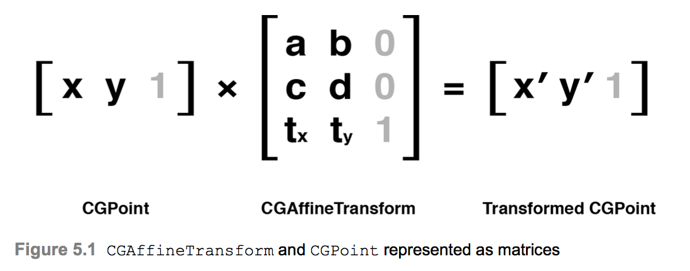
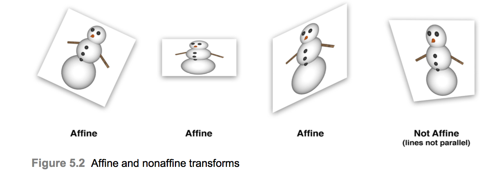
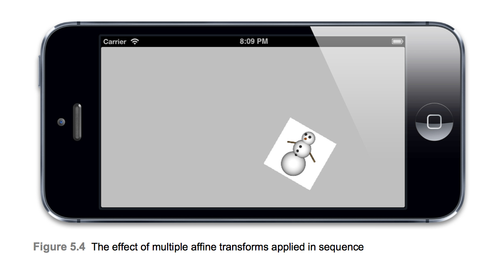
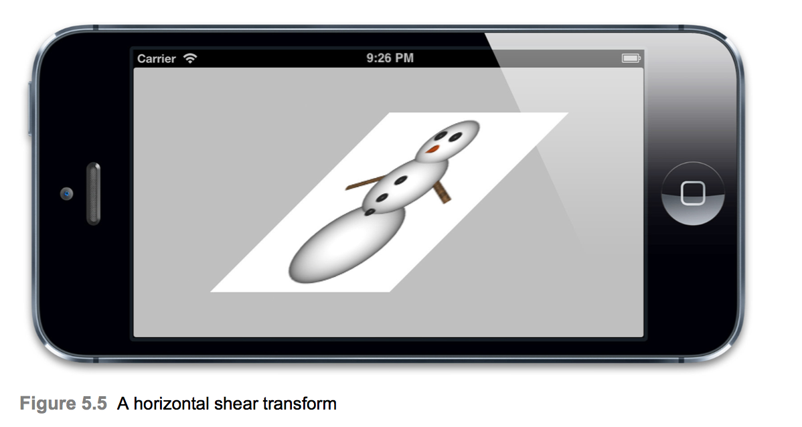
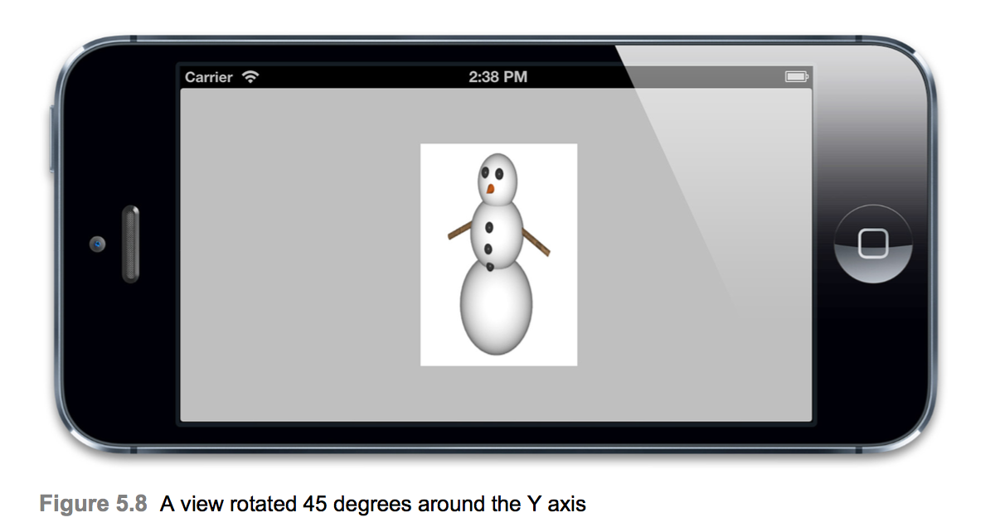

# Transforms
- 4장 'Visual Effects'에서는 레이어 및 그 내용의 모양을 나타내는 몇 가지 기술을 배웠다.
이 장에서는 레이어를 회전, 재배치, 왜곡하는 데 사용할 수 있는 CGAffineTransform과 3차원 표면으로 변경할 수 있는 CATransform3D에 대해서 배울것이다.


### Affine Transforms
- 3장 'Layer Geometry'에서 UIView 변형 속성을 사용하여 시계를 회전시켰지만 실제로 어떤 일이 일어나는지 설명하지 않았다.
UIView 변형 속성은 CGAffineTransform 유형이며 2차원 회전, 비율 및 변환을 나타내는데 사용한다.
- CGAffineTransform은 2D 행 벡터(이 경우 CGPoint)를 곱하여 그 값을 변환할 수 있는 2X3 행렬이다.
아래 그림에서 일반 CGPoint에서 CGAffineTransform행렬과 곱셈을 하기 위해선 수열을 맞춰야 하므로 임시적인 값으로 채운다.(실제로  이값은 결과를 변경하지 않는다.)

- 이러한 이유로 2x3 대신에 3x3 매트릭스로 표현 된 2D 변환을 종종 보게된다.
- 변환 행렬을 레이어에 적용하면 레이어 사각형의 코너가 개별적으로 변형되어 새로운 사각형 모양이 만들어진다.
CGAffineTransform의 `affine`은 행렬에 사용되는 값이 무엇이든간에 변환 이전에 평행 한 레이어의 선이 변형 후에도 평행을 유지한다는 것을 의미한다.
아래는 affine과 nonaffine의 차이점을 보여준다.


### Creating a CGAffineTrasnform
- 행렬 수학에 대해서 설명하기엔 이 장의 범위를 벗어나며, 행렬에 익숙하지 않은 개발자더라도 다행스럽게 Core Graphics에서 행렬을 모르더라도 간단한 변환으로 임의의 변환을 구축할 수 있는 많은 내장함수를 제공한다.
아래 함수는 각각 처음부터 새로운 CGAffineTransform 행렬을 만든다.
  - CGAffineTrasnformMakeRotation(CGFloat angle)
  - CGAffineTrasnformMakeScale(CGFloat sx, CGFloat sy)
  - CGAffineTransformMakeTranslation(CGFloat tx, CGFloat ty)
- 아래는 회전 변환 함수 예이다.

```Swift
class ViewController: UIViewController {
    @IBOutlet weak var layerView: UIView!

    override func viewDidLoad() {
        super.viewDidLoad()
        
        let image = UIImage(named: "Snowman")
        layerView.layer.contents = image?.cgImage
        layerView.layer.contentsGravity = kCAGravityResizeAspect
        
        let tarnsform = CGAffineTransform(rotationAngle: CGFloat(M_PI_4))
        layerView.layer.setAffineTransform(tarnsform)
    }
}
```
- 주의해야할 점은 각도에 사용하는 단위는 라디안이라는 것이다.
```
RADIANS_TO_DEGREES(x) => ((x)/M_PI*180.0)
DEGREES_TO_RADIANS(x) => ((x)/180.0*M_PI)
```

### Combining Transforms
- Core Graphics는 또한 기존 그래픽 위에 변환을 적용하는데 사용할 수 있는 두 번째 기능 세트를 제공한다. 예를 들어, 레이어의 크기 조절하고 회전하는 단일 변환 행렬을 만들려는 경우에 유용하다.
이러한 기능은 다음과 같다.
  - CGAffineTransformRotate(CGAffineTransform t, CGFloat angle)
  - CGAffineTransformScale(CGAffineTransform t, CGFloat sx, CGFloat sy)
  - CGAffineTransformTranslate(CGAffineTransform t, CGFloat tx, CGFloat ty)

- 변환을 조작할 때는 CGAffineTransform에 0 또는 nil과 동등한 변환을 생성할 수 있는것이 필요하다. 행렬에서 이를 단위행렬(Identiti matrix)이라고 알려져 있으며 Core graphics에서는 CGAffineTransformIdentity가 단위행렬 역할을 한다.
- 두 개의 기존 변환 행렬을 결합하려는 경우 두 개의 기존 행렬에서 새로운 CGAffineTransform 행렬을 만드는 함수를 사용할 수 있다. 이는 CGAffineTransformCancat이다.
- 아래 예제는 스케일을 적용한 후 30도 회전을 적용하고, 마지막으로 이동 변환을 적용하는 것이다.

```Swift
class ViewController: UIViewController {
    @IBOutlet weak var layerView: UIView!

    override func viewDidLoad() {
        super.viewDidLoad()
        
        let image = UIImage(named: "Snowman")
        layerView.layer.contents = image?.cgImage
        layerView.layer.contentsGravity = kCAGravityResizeAspect
        
        var transform = CGAffineTransform.identity
        
        transform = transform.scaledBy(x: 0.5, y: 0.5)
        transform = transform.rotated(by: CGFloat(M_PI / 180.0 * 30.0))
        transform = transform.translatedBy(x: 200, y: 0)
        
        layerView.layer.setAffineTransform(transform)
    }
}
```
- 결과를 보면 알겠지만 우리가 원하던 결과가 안나왔다.(y축에 대한 이동이 없었는데 되었다.) 이는 스케일링 되고 회전되면서 실제로 100포인트 아래로 대각선으로 변환되었기 때분이다.

### The Shear Transform
- Core Graphoics는 변환 매트릭스의 올바른 값을 계산하는 함수를 제공하기 때문에 CGAffineTransform의 필드를 직접 설정해야 하는 경우는 거의 없다.
하지만 변경해야 할 상황 중 하나는 Core Graphics가 내장 기능을 제공하지 않는 전단 변환을 만들려는 경우이다.

```Swift
class ViewController: UIViewController {
    @IBOutlet weak var layerView: UIView!

    override func viewDidLoad() {
        super.viewDidLoad()
        
        let image = UIImage(named: "Snowman")
        layerView.layer.contents = image?.cgImage
        layerView.layer.contentsGravity = kCAGravityResizeAspect
               
        layerView.layer.setAffineTransform(CGAffineTransformMakeShear(x: 1, y: 0))
    }
    
    func CGAffineTransformMakeShear(x: CGFloat, y: CGFloat) -> CGAffineTransform {
        var transform = CGAffineTransform.identity
        transform.c = -x
        transform.b = y
        return transform
    }
}
```

### 3D Transform
- CG 접두어 처럼 CGAffineTransform 유형은 Core Graphics 프레임 워크에 속하며, Core Graphics는 엄격하게 2D 드로잉 API이다.
3장에서 Layer의 속성 중 zPosition 프로퍼티를 배웠는데, 이는 카메라로 향하거나 카메라에서 멀어지게 하는 방향(사용자의 시점)을 이동할 수 있게한다.
이를 위해 CATransform3D 행렬이 존재하며 z축을 감안해야하기 때문에 기존의 CGAffineTransform과 달리 4x4 행렬이다.

- 3D 변환을 위해서도 몇몇 API를 제공한다.
  - CATransform3DMakeRotation
  - CATransform3DMakeScale
  - CATransform3DMakeTranslation

- 다음은 y축에 대한 3D 회전 예제를 볼것이다.

```Swift
class ViewController: UIViewController {
    @IBOutlet weak var layerView: UIView!

    override func viewDidLoad() {
        super.viewDidLoad()
        
        let image = UIImage(named: "Snowman")
        layerView.layer.contents = image?.cgImage
        layerView.layer.contentsGravity = kCAGravityResizeAspect

        let transform = CATransform3DMakeRotation(CGFloat(M_PI_4), 0, 1, 0)
        layerView.layer.transform = transform
    }
}
```
- 전혀 회전한것처럼 보이지 않는다. 단지 얇아진것처럼만 보인다. 하지만 실제로 위의 에제는 회전을 적용한 것이다. 이유는 단순히 원근감이 빠졌기 때문이다.
### Perspective Projection
- 위와 같은 문제를 해결하기 위해서는 원근감 변환(z 변환이라고도 불림)을 포함하도록 변환행렬을 수정해야한다.
원근감 변환을 설정하는 함수를 제공하지 않으므로 매트릭스의 값을 수동으로 수정해야 한다. 어려워 보이지만 실제로는 간단하다.
CATransform3D의 원근감 효과는 행렬 요소 m34의 단일값으로 제어할 수 있다.

- 기본적으로 m34의 값은 0이다. m34의 값을 -1.0 / distance로 설정하여 뷰에 관점을 적용할 수 있다. 여기서 distance는 가상 카메라와 화면 사이의 거리이다.
카메라가 실제로 존재하지 않기 때문에 거리는 우리가 계산할 필요가 없다. 보통 500 ~ 1000 사이의 값은 잘 작동하지만 주어진 레이어 배치에 따라서 더 작거나 더 큰 값이 잘나타날 수도 있다.
거리값을 줄이면 원근감 효과가 증가하며, 거리값을 늘리면 전혀 원근감이 없는 것처럼 보일것이다.
- 다음은 원근감을 적용한 예제이다.

```Swift
class ViewController: UIViewController {
    @IBOutlet weak var layerView: UIView!

    override func viewDidLoad() {
        super.viewDidLoad()
        
        let image = UIImage(named: "Snowman")
        layerView.layer.contents = image?.cgImage
        layerView.layer.contentsGravity = kCAGravityResizeAspect
        
        var transform = CATransform3DIdentity
        transform.m34 = -1.0 / 500.0
        transform = CATransform3DRotate(transform, CGFloat(M_PI_4), 0, 1, 0)
        layerView.layer.transform = transform
    }
}
```
