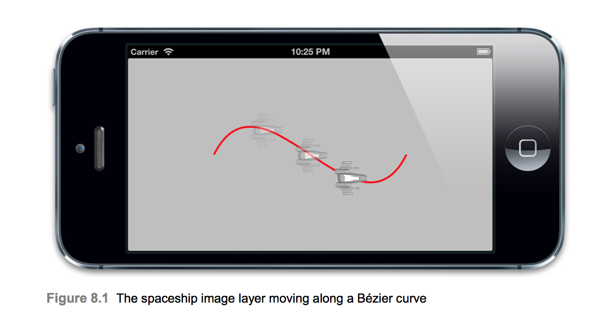
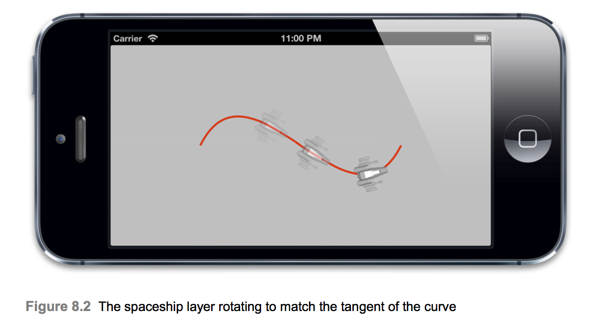
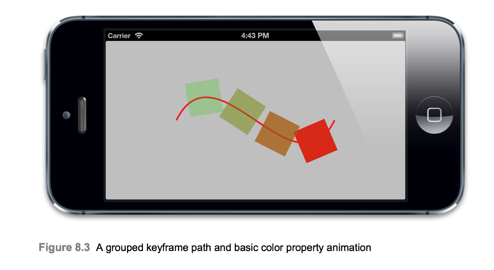
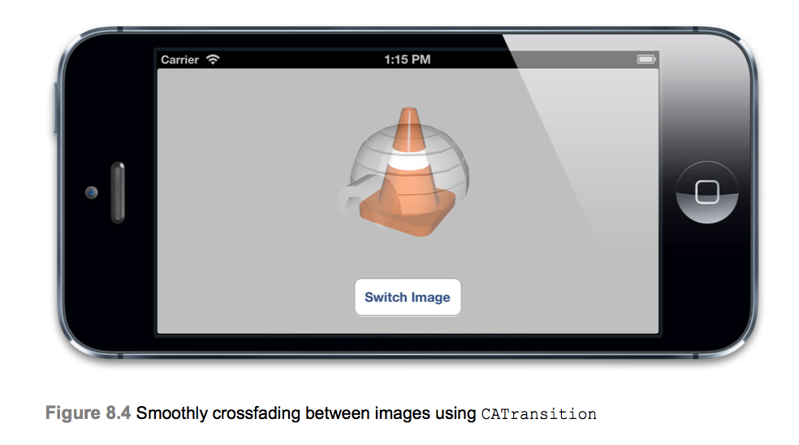
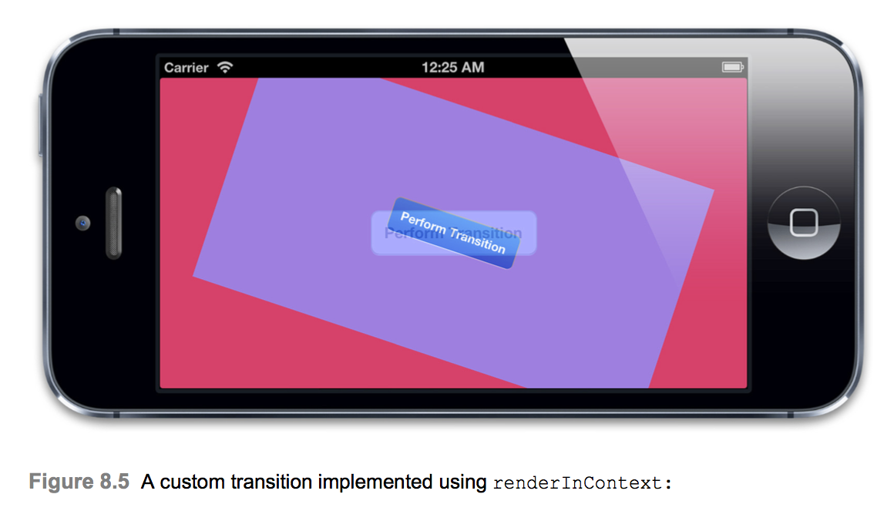
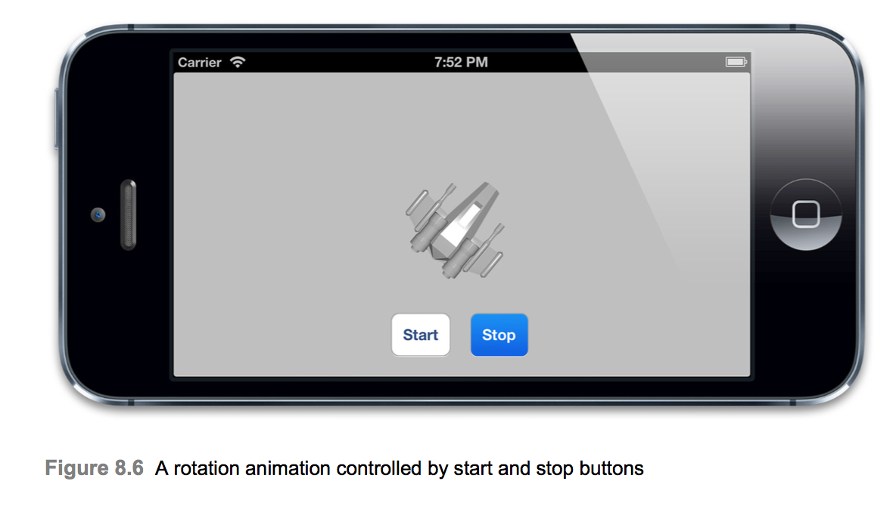

# Explicit Animations
* 이전 장에서는 Implicit Animations에 대하여 배웠다. Implicit Animations은 iOS에 애니메이션 사용자 인터페이스를 만드는 간단한 방법이며, UIKit의 자체 애니메이션 메서드를 기반으로하는 메커니즘이지만 완전히 범용 애니메이션 솔루션은 아니다. 이 장에서는 명시적 애니메이션을 살펴보고 특정 속성에 대한 사용자 지정 애니메이션을 만들거나 임의의 곡선을 따라 이동하는 것과 같은 비선형 애니메이션을 만들것이다.

## Property Animations
* 속성 애니메이션은 레이어의 단일 속성을 대상으로하고 해당 속성이 움직일 목표 값 또는 값 범위를 지정한다. 속성 애니메이션은 기본 및 키 프레임의 두 가지 유형으로 제공된다.

### Basic Animations
* 애니메이션은 시간이 지남에 따라 발생하는 변화이며 가장 심플한 변화는 특정한 값이 다른 값으로 변경되는 경우이다. CABasicAnimation이 앞서 말한 변화를 모델링하도록 설계되었다.

* CABasicAnimation은 추상 CAPropertyAnimation 클래스의 하위 클래스이며 Core Animation에서 지원하는 모든 애니메이션 유형의 기본 추상클래스는 CAAnimation이다. CAAnimation은 추상클래스이기때문에 실제로 그 자체만으로는 대단히 많은 기능이 있지는 않다. CAAnimation은 타이밍 기능(10장 "Easing"에서 설명), 델리게이트(애니메이션 상태에 대한 피드백을 얻는데 사용되는) 및 removedOnCompletion flag(애니메이션이 완료되고 자동적으로 메모리에서 릴리즈 할 것인지 여부이며 기본값은 true이다.) 등이 있다.

* 또한 CAAnimation은 CAAction(모든 CAAnimation 하위 클래스가 레이어 액션으로 제공되도록 허용) 및 CAMediaTiming(9장 "Layer Time"에서 자세히 설명)을 비롯한 여러 프로토콜을 구현한다.

* CAPropertyAnimation은 애니메이션의 keyPath 값으로 지정된 단일 속성에서 작동한다. CAAnimation은 항상 특정 CALayer에 적용되므로 keyPath는 해당 계층을 기준으로 한다.

* 속성 이름이 아니라 keyPath(임의로 중첩된 개체를 가리킬 수 있는 점('.')으로 구분된 키의 시퀀스)라는 사실이 흥미롭다. 

* CABasicAnimation은 다음 세가지 추가 특성을 사용하여 CAPropertyAnimation을 확장한다.
  * fromValue : 애니메이션의 시작 부분에 있는 속성값을 나타낸다.
  * toValue : 애니메이션의 마지막 부분에 있는 속성값을 나타낸다.
  * byValue : 애니메이션 중에 값이 변경되는 상대적인 양을 나타낸다.
* 위의 세가지 속성을 결합하면 다양한 방법으로 값의 변경을 지정할 수 있다.
* 속성애니메이션은 숫자 값, 벡터, 변형 행렬 및 색상과 이미지를 비롯한 다양한 속성 유형과 함게 사용할 수 있이므로 Any타입으로 정의된다.

* fromValue, toValue, byValue 속성은 다양한 조합으로 사용할 수 있지만 한 번에 3개를 모두 지정하면 모순이 발생할 수 있다. 예를들어 fromValue를 2, toValue를 4, byValue를 3으로 지정하면 Core Animation은 최종 값이 4(toValue로 지정된 값) 또는 5(fromValue + byValue)인지 여부를 알 수 없다. 이 3가지의 사용 방법은 CABasicAnimation의 헤더파일에 상세하게 명시되어있다. 일반적으로 toValue 혹은 byValue 중 하나만 지정하여 사용한다.
```Swift
class ViewController: UIViewController {
    @IBOutlet weak var layerView: UIView!
    
    @IBAction func changeColorButtonAction(_ sender: Any) {
        changeColor()
    }
    let layer = CALayer()
    
    override func viewDidLoad() {
        super.viewDidLoad()
        layer.frame = CGRect(x: 50, y: 50, width: 100, height: 100)
        layer.backgroundColor = UIColor.blue.cgColor
        
        layerView.layer.addSublayer(layer)
    }
}

extension ViewController {
    func changeColor() {
        let red = CGFloat(arc4random()) / CGFloat(INT_MAX)
        let green = CGFloat(arc4random()) / CGFloat(INT_MAX)
        let blue = CGFloat(arc4random()) / CGFloat(INT_MAX)
        let color = UIColor(red: red, green: green, blue: blue, alpha: 1.0)
        
        let animation = CABasicAnimation(keyPath: "backgroundColor")
        animation.toValue = color.cgColor
        layer.add(animation, forKey: nil)
    }
}
```
* 위의 예제를 실행하게 되면 제대로 실행되지 않는다. 그 이유는 애니메이션이 레이어의 모델을 수정하지 않고 프리젠테이션만 수정하기 때문이다. 애니메이션이 끝나고 레이어에서 젝되면 레이어는 모델 속성에 의해 정의된 모양으로 되돌아간다. 레이어 트리의 backgroundColor 속성을 변경하지 않았으므로 레이어가 원래 색상으로 돌아간다.

* 이전에 암시적 애니메이션을 사용하고 있을 때 기본 액션은 방금 사용한것과 같은 CABasicAnimation을 사용하여 구현되어있다.(7장에서 actionForLayer: forKey: delegate 메소드의 결과를 로깅하여 액션 유형이 CABasicAnimation임을 알 수 있다.) 그 경우에는 속성을 설정하여 애니메이션을 트리거 하였지면 위의 방식은 애니메이션을 직접 수행하지만 속성을 더 이상 설정하지 않는다.

* 애니메이션을 레이어 액션으로 지정하면(그리고 속성 값을 변경하여 애니메이션을 트리거한다.) 속성 값과 애니메이션 상태를 동기화하는 것이 가장 쉬운 방법이지만 어떤 이유에서든 이를 수행할 수 없을 경우(일반적으로 우리가 애니 메이팅을 해야하는 레이어는 UIView의 backing layer이다.) 애니메이션을 시작하기 직전이나 애니메이션이 끝난 직후에 속성 값을 업데이트 할 수 있는 두가지 옵션이 있다.

* 애니메이션이 시작되기 전에 속성을 업데이트하는 것이 이러한 옵션보다 간단하지만 암시적 fromValue를 사용할 수 없다는 것을 의미하므로 애니메이션의 fromValue를 수동으로 설정하여 레이어의 현재 값과 일치시켜야한다.

* 이를 고려하여 애니메이션을 생성하는 위치와 레이어에 추가하는 위치 사이에 다음 두 줄을 삽입하면 스냅 백을 제거할 수 있다.
```Swift
animation.fromValue = layer.backgroundColor
layer.backgroundColor = color.cgColor
```
이러한 변경 작업을 수행하면 다음과 같은 결과가 나온다.
```Swift
class ViewController: UIViewController {
    @IBOutlet weak var layerView: UIView!
    
    @IBAction func changeColorButtonAction(_ sender: Any) {
        changeColor()
    }
    let layer = CALayer()
    
    override func viewDidLoad() {
        super.viewDidLoad()
        layer.frame = CGRect(x: 50, y: 50, width: 100, height: 100)
        layer.backgroundColor = UIColor.blue.cgColor
        
        layerView.layer.addSublayer(layer)
    }
}

extension ViewController {
    func applyBasicAnimation(animation: CABasicAnimation, toLayer: CALayer) {
        animation.fromValue = toLayer.presentation()?.value(forKey: animation.keyPath ?? "")
        
        CATransaction.begin()
        CATransaction.setDisableActions(true)
        toLayer.setValue(animation.toValue, forKey: animation.keyPath ?? "")
        CATransaction.commit()
        
        toLayer.add(animation, forKey: nil)
    }
    
    func changeColor() {
        let red = CGFloat(arc4random()) / CGFloat(INT_MAX)
        let green = CGFloat(arc4random()) / CGFloat(INT_MAX)
        let blue = CGFloat(arc4random()) / CGFloat(INT_MAX)
        let color = UIColor(red: red, green: green, blue: blue, alpha: 1.0)
        
        let animation = CABasicAnimation(keyPath: "backgroundColor")
        animation.toValue = color.cgColor
        applyBasicAnimation(animation: animation, toLayer: layer)
    }
}
```
* 위와같은 구현은 byValue가 아닌 toValue를 사용하여 애니메이션을 처리하는 것이 일반적인 솔루션의 좋은 예이다. 보다 편리하고 재사용 할 수 있도록 CALayer의 카테고리 메소드로 패키지화 할 수 있다.

* 이러한 모든 문제는 겉으로 보기에는 단순한 문제를 해결하는 데 많은 어려움이 될 수 있지만 해결방안은 상당히 복잡하다. 애니메이션을 시작하기 전에 대상 속성을 업데이트 하지 않으면 애니메이션이 완전히 완료될 때 까지 대상 속성을 업데이트 할 수 없거나 진행중인 CABasicAnimation을 취소된다.

### CAAnimationDelegate
* 7장에서 암시적 애니메이션을 사용할 때 우리는 CATransaction 완료 블록을 사용하여 애니메이션이 끝난 시점을 탐지할 수 있었다. 그러나 애니메이션이 트랜잭션과 연관되어 있지 않으므로 명시적 애니메이션을 사용하는 경우에 이 방법을 사용할 수 없다. 명시적 애니메이션이 끝난시기를 확인하려면 CAAnimationDelegate 프로토콜을 준수하는 클래스의 애니메이션 Delegate 속성을 사용해야한다.

* 새 트랜잭션을 설정하고 속성을 업데이트 할 때 레이어 액션을 비활성화해야한다. 그렇지 않으면 명시적인 CABasicAnimation 때문에 애니메이션이 두 번 발생하고 그 속성에 대한 암시적 애니메이션 작업으로 인해 애니메이션이 다시 발생한다.

```Swift
class ViewController: UIViewController {
    @IBOutlet weak var layerView: UIView!
    
    let layer = CALayer()
    
    override func viewDidLoad() {
        super.viewDidLoad()
        layer.frame = CGRect(x: 50, y: 50, width: 100, height: 100)
        layer.backgroundColor = UIColor.blue.cgColor
        
        layerView.layer.addSublayer(layer)
    }
}

extension ViewController {
    func changeColor() {
        let red = CGFloat(arc4random()) / CGFloat(INT_MAX)
        let green = CGFloat(arc4random()) / CGFloat(INT_MAX)
        let blue = CGFloat(arc4random()) / CGFloat(INT_MAX)
        let color = UIColor(red: red, green: green, blue: blue, alpha: 1.0)
        
        let animation = CABasicAnimation(keyPath: "backgroundColor")
        animation.toValue = color.cgColor
        animation.delegate = self
        layer.add(animation, forKey: nil)
    }
}

extension ViewController: CAAnimationDelegate {
    func animationDidStop(_ anim: CAAnimation, finished flag: Bool) {
        CATransaction.begin()
        CATransaction.setDisableActions(true)
        if let animation = anim as? CABasicAnimation {
            layer.backgroundColor = animation.toValue as! CGColor?
        }
        CATransaction.commit()
    }
}
```

* 완료 블록 대신 델리게이트 패턴을 사용하는 CAAnimation의 문제점은 추적할 여러 애니메이션 또는 애니메이션 레이어가 있을 때 매우 어렵다. 뷰컨트롤러에서 애니메이션을 생성할 때 컨트롤러를 애니메이션 위임자로 사용하지만 모든 애니메이션이 동일한 델리게이트 메서드를 호출하므로 어떤 완료 호출을 결정해야할지 방법이 필요하다.

* 3장 `Layer Geometry`의 시계를 고려했을 때 원래 매초마다 초침의 각도를 업데이트함으로써 애니메이션 없이 시계를 구현했다. 암시적 애니메이션을 사용하여 초침을 애니메이트 할 수 없다. 그 이유는 초침이 UIView 인스턴스에 의해 표현되고 암시적 애니메이션이 비활성화되어 있기 때문이다.

* 그렇다면 어떻게 애니메이션의 어떤 뷰가 완료되었다는 것을 알 수 있을까?

* 간단하다. CAAnimation은 KVC 프로토콜을 준수하기 때문에 setValue:, forKey 및 valueForKey 메소드를 사용하여 키에 value를 맵핑하면된다.
```Swift
...

func setAngle(angle: CGFloat, handView: UIView, animated: Bool) {
    let transform = CATransform3DMakeRotation(angle, 0, 0, 1)

    if animated {
        let animation = CABasicAnimation(keyPath: "transform")
        animation.toValue = NSValue(caTransform3D: transform)
        animation.duration = 0.5
        animation.delegate = self
        animation.setValue(handView, forKey: "handView")
        hanView.layer.add(animation, forKey: nil)
    } else {
        hanView.layer.transform = transform
    }
}

extension ViewController: CAAnimationDelegate {
    func animationDidStop(_ anim: CAAnimation, finished flag: Bool) {
        let view = anim.valueForKey("handView")
        if let animation = anim as? CABasicAnimation {
            view.layer.transform = animation.toValue.caTransform3DValue
        }
    }
}

...
```
* 위의 방법으로 애니메이션이 끝나고 올바른 값으로 변형된것을 확인했다. 하지만 이러한 조치를 취한 후에도 또 다른 문제가 있다. 시뮬레이터에선 잘되지만 실제 디바이스에서 animationDidStop가 호출되기 이전에 시계 바늘이 잠시 원래 값으로 돌아오는 것을 볼 수 있다.

* 문제는 애니메이션이 끝난 후에 콜백 메서드가 호출 되더라도 애니메이션 속성이 전 상태로 리셋되기 전에 호출된다는 보장이 없다. 이것은 시뮬레이터 뿐 만 아니라 장치에서 항상 애니메이션 코드를 테스트해야하는 이유의 좋은 예이다.

* `fillMode`라는 속성을 사용하여 이 문제를 해결할 수 있다. 이는 다음장에서 살펴볼 것이다.

### Keyframe Animations
* CABasicAnimation은 iOS의 암시적 애니메이션 대부분에 숨어있는 기본 메커니즘을 보여주지만 CABasicAnimation을 명시적으로 레이어에 추가하는것은 동일한 효과를 얻을 수 있는 더 간단한 방법이 있을 때 약간의 이점이 있다. 그러나 CAKeyframeAnimation은 상당히 강력하고 UIKit에 노출된 인터페이스가 없다.

* CAkeyframeAnimation은 CAPropertyAnimation의 하위 클래스인 CABasicAnimation과 같다. 하나의 속성에서 계속 작동하지만 CABasicAnimation과 달리 단 하나의 시작 및 끝 값에만 국한되지 않고 사이에 애니메이션을 적용할 임의의 시퀀스 값을 제공할 수 있다.
```Swift
let keyframeAnimation = CAKeyframeAnimation(keyPath: "backgroundColor")
        keyframeAnimation.duration = 2.0
        keyframeAnimation.values = [
            UIColor.blue.cgColor,
            UIColor.red.cgColor,
            UIColor.green.cgColor,
            UIColor.blue.cgColor,
        ]
        layer.add(keyframeAnimation, forKey: nil)
```
* 위에서 시퀀스의 시작과 끝 색상을 파란색으로 지정했다. 이는 CAKeyframeAnimation이 자동으로 현재 값을 첫 번째 프레임으로 사용하는 옵션을 가지고 있지 않기 때문에 필요하다.(CABasicAnimation에서 fromValue를 nil로 남겨두었던것처럼). 애니메이션은 시작 시 첫 번째 키 프레임 값으로 바로 이동하고 완료되면 즉시 원래 속성 값으로 되돌아간다. 따라서 부드러운 애니메이션의 경우 시작 및 끝 키 프레임을 동일한 값으로 일치시킨다.

* `duration`을 0.2초에서 2초로 변경하였는데 그 이유는 시퀀스를 순회할 때 동일한 시간을 두고 애니메이션이 적용되기 때문에 정말 이상하게 보이기 때문이다. 이를 더 자연스럽게 보이게 하려면 10장에서 배울것이다.

* CAKeyframeAnimation은 CGPath를 사용하여 애니메이션을 지정하는 다른 방법이 있다. path 속성을 사용하면 Core Graphics 함수를 사용하여 애니메이션을 그리는 방식으로 직관적인 시퀀스 동작을 정의할 수 있다.

* 이를 위해 예제 한가지를 해 볼 것이다.
```Swift
class ViewController: UIViewController {
    @IBOutlet weak var bezierCurveView: UIView!
    
    let layer = CALayer()
    
    override func viewDidLoad() {
        super.viewDidLoad()
        let path = UIBezierPath()
        path.move(to: CGPoint(x: 0, y: 75))
        path.addCurve(to: CGPoint(x: 300, y: 75), controlPoint1: CGPoint(x: 75, y: 0), controlPoint2: CGPoint(x: 225, y: 150))
        
        let pathLayer = CAShapeLayer()
        pathLayer.path = path.cgPath
        pathLayer.fillColor = UIColor.clear.cgColor
        pathLayer.strokeColor = UIColor.red.cgColor
        pathLayer.lineWidth = 3.0
        bezierCurveView.layer.addSublayer(pathLayer)
        
        let shipLayer = CALayer()
        shipLayer.frame = CGRect(x: 0, y: 0, width: 64, height: 64)
        shipLayer.position = CGPoint(x: 0, y: 75)
        shipLayer.contents = UIImage(named: "Ship")?.cgImage
        bezierCurveView.layer.addSublayer(shipLayer)
        
        let animation = CAKeyframeAnimation(keyPath: "position")
        animation.duration = 4.0
        animation.path = path.cgPath
        shipLayer.add(animation, forKey: nil)
    }
}
```


* 예제를 실행하면 우주선의 애니메이션이 약간 비현실적으로 보일 수 있다. 왜냐면 곡선의 탄제트와 일치하도록 움직이기 보다는 항상 오른쪽만 직접 가리키기 때문이다. 우주선의 affineTransform을 조정하여 움직이는 방향으로 애니메이션을 만들 수 있지만 다른 애니메이션과 동기화하는 것은 까다로울 수 있다.

* 다행히도 Apple은 이 시나리오를 예상하고 rotationMode라는 CAKeyframeAnimation에 속성을 추가했다. rotationMode를 상수값 kCAAnimationRotateAuto로 설정하면 레이어는 애니메이션이 적용될 때 곡선의 탄젠트를 따라 자동으로 회전한다.
```Swift
let animation = CAKeyframeAnimation(keyPath: "position")
        animation.duration = 4.0
        animation.path = path.cgPath
        animation.rotationMode = kCAAnimationRotateAuto
        shipLayer.add(animation, forKey: nil)
```


### Virtual Properties
* 우리는 이전에 속성 애니메이션을 동작시키기 위해 keys 대신에 key paths를 사용할 수 있다는것에 대하여 언급하였다. 이는 virtual properties와 sub properties을 애니메이션으로 만들 수 있음을 의미한다.
```Swift
class ViewController: UIViewController {
    @IBOutlet weak var layerView: UIView!

    let layer = CALayer()
    
    override func viewDidLoad() {
        super.viewDidLoad()
        layer.frame = CGRect(x: 50, y: 50, width: 100, height: 100)
        layer.backgroundColor = UIColor.blue.cgColor
        layer.contents = UIImage(named: "Ship")?.cgImage
        layerView.layer.addSublayer(layer)
        
        let animation = CABasicAnimation(keyPath: "transform")
        animation.duration = 2.0
        animation.toValue = NSValue(caTransform3D: CATransform3DMakeRotation(CGFloat(M_PI), 0, 0, 1))
        layer.add(animation, forKey: nil)
    }
}
```
* 위의 예제는 이미지를 M_PI(180도) 회전하면서 애니메이션이 적용되지만, M_PI * 2(360도) 회전시키게 되면 애니메이션이 동작하지 않음을 알 수 있다. 그 이유는 fromValue와 toValue가 같기 때문이다(360도 회전 시 행렬이 fromValue 행렬과 같아짐을 알 수 있다.).

* 각도의 상관없이 선박의 Translation 혹은 Scale 애니메이션을 적용하려면 어떻게 해야할까? 이 두 가지 모두 transform 속성을 수정해야하기 때문에 각각의 시점에서 각 애니메이션의 결합 효과를 다시 계산하고 결합 된 변형 값에서 복잡한 키 프레임 애니메이션을 만들어야 한다.

* 다행스럽게 레이어를 회전시키기 위해서 keys를 사용하는 대신 key paths를 사용하면 쉽게해결할 수 있다. 즉 transform 속성 자체에 애니메이션을 적용하는 대신 transform.rotation key path에 애니메이션을 적용하는 것이다.
```Swift
class ViewController: UIViewController {
    @IBOutlet weak var layerView: UIView!

    let layer = CALayer()
    
    override func viewDidLoad() {
        super.viewDidLoad()
        layer.frame = CGRect(x: 50, y: 50, width: 100, height: 100)
        layer.backgroundColor = UIColor.blue.cgColor
        layer.contents = UIImage(named: "Ship")?.cgImage
        layerView.layer.addSublayer(layer)
        
        let animation = CABasicAnimation(keyPath: "transform")
        animation.duration = 2.0
        animation.toValue = M_PI * 2
        layer.add(animation, forKey: nil)
    }
}
```
* 앞서 동작에선 M_PI * 2는 애니메이션이 적용되지 않았지만 위의 예제는 정상적으로 동작함을 알 수 있다.
* 그렇다면 key paths를 사용하여 애니메이팅하는 것의 이점은 무엇이 있을까?
  * keyframes을 사용하지 않고 한 번에 180도 이상 회전할 수 있다.
  * 절대 회전이 아닌 상대 회전을 수행할 수 있다.(byValue 대신에 toValue)
  * CATransform3D 대신 간단한 숫자 값으로 각도를 지정할 수 있다.
  * transform.position 또는 transform.scale(key paths를 사용하여 개별적으로 애니메이션 가능하다.)과 충돌하지 않는다.

* 이번장은 Virtual Property인데 이상한점을 느끼지 못했는가? 바로 transform.rotation 속성은 실제로 존재하지 않는다는 것이다! CATransform3D는 객체가 아니기 때문에 존재할 수 없다(오호~). 또한 구조체 이므로 KVC 호환 속성을 가질 수 없다. transform.rotation은 실제로 CALayer가 transforms 애니메이션 처리 과정을 단순화하기 위해 제공하는 가상 속성이다.
* 짚고넘어가야할 것은 transform.rotation이나 transform.scale과 같은 속성을 직접 설정할 수 없다는 것이다. 애니메이션에서만 사용할 수 있다. 이러한 속성을 애니메이션화하면 Core Animation은 CAValueFunction이라는 클래스를 사용하여 변경 사항이 필요로 하는 실제 값으로 transform 속성을 자동으로 업데이트한다.
* CAValueFunction은 자연스럽게 합치거나 보간할 수 없는 속성을 애니메이션화 하는데 유용한 매커니즘이 될 수 있지만 CAValueFunction의 구현 세부 정보는 비공개이므로 새로운 값을 만들기 위해 하위 클래스로는 현재 사용할 수 없다. Apple이 이미 상수로 정한 함수만 사용할 수 있다.

### Animation Groups
* CABasicAnimation과 CAKeyframeAnimation은 개별 속성 대상으로 하지만 CAAnimationGroup을 사용하여 이러한 애니메이션을 여러개로 모을 수 있다.

* CAAnimationGroup는 CAAnimation의 또 다른 하위 클래스로 애니메이션 배열 속성을 추가하여 다른 애니메이션을 그룹화하는 데 사용된다.

* Animation group을 레이어에 추가하는 것은 애니메이션을 개별적으로 추가하는 것과는 근본적으로 다르므로 Animation group을 사용할 시기 또는 이유를 즉시 알 수 없다. 그룹내의 애니메이션 지속시간을 설정하거나 하나의 명령으로 레이어에서 여러 애니메이션을 추가 및 제거할 수 있는 편의성을 제공하지만 실질적인 유용성은 9장의 계층적인 타이밍 관련해서 명백해진다.

```Swift
class ViewController: UIViewController {
    override func viewDidLoad() {
        let path = UIBezierPath()
        path.move(to: CGPoint(x: 0, y: 75))
        path.addCurve(to: CGPoint(x: 300, y: 75), controlPoint1: CGPoint(x: 75, y: 0), controlPoint2: CGPoint(x: 225, y: 150))
        
        let pathLayer = CAShapeLayer()
        pathLayer.path = path.cgPath
        pathLayer.fillColor = UIColor.clear.cgColor
        pathLayer.strokeColor = UIColor.red.cgColor
        pathLayer.lineWidth = 3.0
        bezierCurveView.layer.addSublayer(pathLayer)
        
        let shipLayer = CALayer()
        shipLayer.frame = CGRect(x: 0, y: 0, width: 64, height: 64)
        shipLayer.position = CGPoint(x: 0, y: 75)
        shipLayer.backgroundColor = UIColor.green.cgColor
        bezierCurveView.layer.addSublayer(shipLayer)
        
        let animation1 = CAKeyframeAnimation(keyPath: "position")
        animation1.duration = 4.0
        animation1.path = path.cgPath
        animation1.rotationMode = kCAAnimationRotateAuto
        
        let animation2 = CABasicAnimation(keyPath: "backgroundColor")
        animation2.toValue = UIColor.red.cgColor
        
        let animationGroup = CAAnimationGroup()
        animationGroup.animations = [animation1, animation2]
        animationGroup.duration = 4
        
        shipLayer.add(animationGroup, forKey: nil)
    }
}
```

### Transitions
* 때로는 iOS 응용 프로그램의 속성 애니메이션을 사용하여 애니메이션을 적용하기가 매우 어려운 레이아웃을 변경해야할 수도 있다. 예를들어 텍스트나 이미지를 바꿔야하거나 등등의 일 말이다.
* 속성 애니메이션은 레이어에 가능한 속성에서만 작동하므로 애니메이션이 불가능한 속성(예를들어 이미지)을 변경하거나 계층에서 레이어를 실제로 추가하거나 제거해야하는 경우 속성 애니메이션이 작동하지 않는다.
* Transition animation은 속성 애니메이션과 같이 두 값 사이를 부드럽게 보간하려고 하지 않는다.
* Transition은 특정 속성 대신 전체 레이어에 영향을 준다. Transition은 이전 레이어 모양의 스냅샷을 찍은 다음 단일 모양의 새로운 모양으로 애니메이션을 적용한다.
* Transition을 만들려면 CAAnimation의 다른 하위 클래스인 CATransition을 사용해야한다. CAAnimation에서 상속받은 모든 타이밍 함수 외에도 CATransition에는 전환 효과를 지정하는데 사용되는 유형 및 하위 유형이 있다. Type은 NSString이며 다음 상수값 중 하나를 설정할 수 있다.
  * kCATransitionFade 
  * kCATransitionMoveIn
  * kCATransitionPush
  * kCATransitionReveal

* 현재 위의 4가지 기본 CATransition 유형으로 제한되어 있지만 이 장의 뒷부분에서 설명하는대로 추가 전환효과를 얻을 수 있는 몇가지 방법이 있다.
* 기본 전환 유형은 kCATransitionFade이다. 이전 레이어 모양과 속성 또는 내용을 수정한 후 새 모양 사이에 부드러운 교차 페이드를 만든다. 7장의 사용자 정의 액션 예제에서 kCATransitionPush 유형을 사용했다.
* kCATransitionMoveIn 및 kCATransitionReveal은 kCATransitionPush와 유사하다. 이 두개는 방향 스와이프 애니메이션을 구현하지만 미묘한 차이점을 갖고있다.
* kCATransitionMoveIn은 이전 레이어의 맨 위에 새 레이어 모양을 이동시킨 후 이전 레어어를 사라지게 하지만 push transition 처럼 이전 레이어를 측면으로 push 하지 않으며 kCATransitionReveal은 이전 레이어 위에 새로운 레이어가 생성되며 이전 레이어를 이동시킨 후 사라지게한다. 즉 MoveIn은 새로운 레이어만 이동하고, Reveal은 이전 레이어만 이동한다.(Push는 새로운 레이어와 이전 레이어 모두 이동이 일어난다.)
* kCATransitionReveal의 경우 기본적으로 왼쪽 슬라이드 되지만 다음 상수 중 하나를 선택하여 방향을 변경할 수 있다.
  * kCATransitionFromRight
  * kCATransitionFromLeft
  * kCATransitionFromTop
  * kCATransitionFromBottom

* 예제를 해볼 시간이다.

```Swift
class ViewController: UIViewController {
    @IBOutlet weak var imageView: UIImageView!
    @IBAction func switchImageBtnAction(_ sender: Any) {
        let transition = CATransition()
        transition.type = kCATransitionFade
        
        imageView.layer.add(transition, forKey: nil)
        
        if let currentImage = imageView.image {
            var index = images.index(of: currentImage) ?? 0
            index = (index + 1) % images.count
            imageView.image = images[index]
        }
    }

    var images: [UIImage] = []
    
    override func viewDidLoad() {
        super.viewDidLoad()

        images = [
            UIImage(named: "Anchor")!,
            UIImage(named: "Cone")!,
            UIImage(named: "Igloo")!,
            UIImage(named: "Spaceship")!,
        ]
    }
}
```
* 코드에서 볼 수 있듯이 add(transition, forKey: nil) 메소드를 사용하여 속성 또는 그룹 애니메이션과 같은 방식으로 레이어에 추가된다. 그러나 속성 애니메이션과 달리 한번에 하나의 CATransition만 주어진 레이어에서 작동할 수 있다. 이러한 이유 때문에 key에 대해 지정하는 값에 관계없이 Transition은 실제로 상수 kCATransition으로 표시되는 "Transition"키와 연결된다.

### Implicit Transitions
* CATransition이 레이어에 변경된 사항을 부드럽게 처리할 수 있기 때문에 properties의 레이어 액션으로 사용하기에 이상적이지만 그렇지 않은 경우 애니메이션을 적용하기 어렵다. 물론 애플은 이것을 깨닫고 CALayer 컨텐츠 속성을 설정할 때 CATransition이 기본 동작으로 사용된다. 이것은 다른 모든 암시적 애니메이션 액션과 함께 레이어를 보기 위해 비활성화되지만 사용자가 직접 만든 레이어의 경우 레이어 컨텐츠 이미지의 변경 사항이 자동으로 크로스 페이드로 애니메이션 된다. 7장의 레이어 액션으로 CATransition을 사용하여 레이어의 배경색에 대한 변경사항을 애니메이션으로 나타냈다. backgroundColor 속성은 일반적인 CAPropertyAnimation을 사용하여 애니메이션으로 만들 수 있지만 대신에 CATransition을 사용할 수 있는것은 아니다.

### Animating Layer Tree Changes
* CATransition이 특정 레이어 속성에 작동하지 않는다는 사실은 변경된 내용을 적확하게 모르는 경우에도 레이어 변경 사항을 애니메이션으로 적용할 수 있다는 것을 의미한다. 예를들어 복잡한 내부 UITableView를 크로스 페이드로 재로드하는 작업을 원활하게 처리할 수 있다. 즉, 어떤 행이 추가 및 제거되었는지 또는 내부 뷰 계충 구조에 대해 알 필요없이 두 개의 다른 UIViewController 인스턴스 간에 Transition하지 않아도 된다. 이 두 경우는 레이어 속성 변경뿐만 아니라 실제 레이어 트리 변경에 애니메이션 효과를 적용하기 때문에 지금까지 시도한 것과는 다른 것이다. 애니메이션 과정에서 레이어에 물리적으로 레이어를 추가하거나 제거해야한다.

* 이 경우 Trick은 CATransition이 연결된 레이어가 Transition 중에 트리에서 제거되지 않아야한다. 그러면 CATransition이 함께 제거되기 때문이다. 일반적으로 영향을 받는 레이어의 슈퍼 레이어로 Transition을 연결하면된다.

* 아래 예제에서는 UITabBarController의 탭 사이에서 크로스 페이드 전환을 구현하는 방법을 보여준다. 여기에서는 단순히 기본 탭 응용 프로그램 프로젝트 템플릿을 가져와서 UITabBarControllerdelegate의 tabBarController: didSelectViewController: 메서드를 사용하여 전환 애니메이션을 적용하였다.
```Swift
class TabBarViewController: UITabBarController {

    override func viewDidLoad() {
        super.viewDidLoad()

        
    }
    
    override func tabBar(_ tabBar: UITabBar, didSelect item: UITabBarItem) {
        let transition = CATransition()
        transition.type = kCATransitionFade
        
        view.layer.add(transition, forKey: nil)
    }
}
```

### Custom Transitions
* Transition은 원활하게 변경하기 어려운 속성을 애니메이션으로 만드는 강력한 방법이라는 것을 입증하였다. 그러나 CATransition의 애니메이션 유형 목록은 약간 제한적으로 보인다.
* Apple이 Core Animation의 transition 기능을 UIView + transtionFromView(toView: duration: options: completion:) 및 transitionWithView(duration: options: animations:) 메소드를 통해 노출하지만, 사용 가능한 Transition 옵션은 CATransition의 Type Property의 이용가능한 상수와 완전히 다르다.
* UIView Transition 방법 옵션 매개 변수에 지정할 수 있는 상수는 다음과 같다.
  * UIViewAnimationOptionTransitionFlipFromLeft 
  * UIViewAnimationOptionTransitionFlipFromRight 
  * UIViewAnimationOptionTransitionCurlUp
  * UIViewAnimationOptionTransitionCurlDown
  * UIViewAnimationOptionTransitionCrossDissolve
  * UIViewAnimationOptionTransitionFlipFromTop
  * UIViewAnimationOptionTransitionFlipFromBottom

* UIViewAnimationOptionTransitionCrossDissolve를 제외하고 이러한 전환 중 어느것도 CATransition Type에 해당하지 않는다. 이전의 Transition 예제의 수정된 버전을 사용하여 이러한 Transition 테스트를 할 수 있다.
```Swift
class ViewController: UIViewController {
    @IBOutlet weak var imageView: UIImageView!
    @IBAction func switchImageBtnAction(_ sender: Any) {
        UIView.transition(with: imageView, duration: 1.0, options: [.transitionFlipFromLeft], animations: {
            if let currentImage = self.imageView.image {
                var index = self.images.index(of: currentImage) ?? 0
                index = (index + 1) % self.images.count
                self.imageView.image = self.images[index]
            }
        }, completion: nil)
    }

    var images: [UIImage] = []
    
    override func viewDidLoad() {
        super.viewDidLoad()

        images = [
            UIImage(named: "Anchor")!,
            UIImage(named: "Cone")!,
            UIImage(named: "Igloo")!,
            UIImage(named: "Spaceship")!,
        ]
    }
}
```
* 문서에서 iOS5(Core Image Framework를 도입한 이후) 이후 CIFilter를 CATransition의 필터 속성과 함께 사용하여 추가 전환 유형을 만들 수 있음을 암시하는것으로 보인다. 그러나 iOS6에서는 여전히 작동하지 않는다. Core Image Filter를 CATransition과 함게 사용하면 아무 효과가 없다.(이것은 Mac OS에서만 지원되며 문서 불일치를 설명한다. 지금은 바뀌어있겠지..?)

* 이러한 이유로 사용자는 원하는 효과에 따라 CATransition 또는 UIView 전환 방법 중 하나를 선택해야한다. 다행히도 iOS 차기 버전에서는 Core Image 전환 필터가 추가되어 CATransition을 통해 Core Image 전환 애니메이션 전체를 사용할 수 있다(새 동영상 제작 기능을 추가할 수도 있음.).

* iOS에서 Cusmtom transition effects를 얻는 것은 불가능하다는 의미는 아니다. 단지 약간의 추가작업을 해야 할 뿐이다. 앞에서 설명한 것처럼 전환 애니메이션의 기본 원칙은 레이어의 현재 상테에 대한 스냅샷을 찍은 다음 장면 뒤에서 레이어를 변경하는 동안 해당 스냅샷에 애니메이션을 적용한다는 것이다. 레이어의 스냅샷을 만드는 방법을 파악할 수 있다면 CATransition이나 UIKit의 
Transition 방법을 사용하지 않고 일반적인 속성 애니메이션을 사용하여 애니메이션을 직접 수행할 수 있다.

* 레이어의 스냅샷을 찍는 것은 상대적으로 쉽다. CALayer는 현재 내용의 이미지를 Core Graphics 컨텍스트에 그려서 다른 이미지에 표시할 수 있는 `renderInContext` 메서드를 가지고 잇다. 이 스냅샷을 원본 앞에 놓으면 실제 뷰 내용에 대한 변경 사항을 숨기므로 간단한 전환 효과를 다시 만들 수 있다.

* 아래 예제는 아이디어의 기본 구현을 보여준다. 현재 뷰 상태의 스냅샷을 찍은 다음 원래 뷰의 배경색을 변경하는 동안 스냅샷을 회전 및 페이드아웃한다. 아래 그림은 진행중인 사용자 정의 전환을 보여준다. 간단한 작업을 위해 UIView.animate 메소드를 사용하여 애니메이션을 수행했다. CABasicAnimation을 사용하여 똑같은 효과를 낼 수도 있지만 이것을 사용하면 레이어 변환 및 불투명도 속성에 별도의 애니메이션을 분리하는 설정을 해야하고 CAAnimationDelegate를 구현하여 애니메이션이 완료되면 화면에서 corverView를 제거해야한다.


```Swift
class ViewController: UIViewController {
    @IBAction func performTransition(_ sender: Any) {
        UIGraphicsBeginImageContextWithOptions(view.bounds.size, true, 0.0)
        view.layer.render(in: UIGraphicsGetCurrentContext()!)
        let coverImage = UIGraphicsGetImageFromCurrentImageContext()
        
        let coverView = UIImageView(image: coverImage)
        coverView.frame = view.bounds
        view.addSubview(coverView)
        
        let red = CGFloat(arc4random()) / CGFloat(INT_MAX)
        let green = CGFloat(arc4random()) / CGFloat(INT_MAX)
        let blue = CGFloat(arc4random()) / CGFloat(INT_MAX)
        view.backgroundColor = UIColor(red: red, green: green, blue: blue, alpha: 1.0)
        
        UIView.animate(withDuration: 1.0, animations: {
            var transform = CGAffineTransform.init(scaleX: 0.01, y: 0.01)
            transform = transform.rotated(by: CGFloat(M_PI_2))
            coverView.transform = transform
            coverView.alpha = 0.0
        }, completion: { _ in
            coverView.removeFromSuperview()
        })
    }
    
    override func viewDidLoad() {
        super.viewDidLoad()
    }
}
```
* 위와 같은 접근방식에 대한 주의사항이 있다. renderInContext 메서드는 레이어의 배경 이미지와 하위 레이어를 캡처하지만 해당 하위 레이어에 적용된 변환을 올바르게 처리하지 않으며, 비디오 또는 OpenGL 콘텐츠에서 작동하지 않는다. CATransition은 이 제한의 영향을 받지 않는것으로 보이므로 아마도 개인 메서드를 사용하여 스냅샷을 캡처할 수 있다.

### Canceling an animation in Progress
* 이 장의 앞부분에서 설명한 것처럼 `add(anim: CAAnimation, forKey: String?)` 메서드의 key 매개 변수를 사용하여 다음 방법과 같이 레이어에 추가된 애니메이션을 검색할 수 있다.
```Swift
animation(forKey: String)
```
* 특정 애니메이션을 종료하려면 다음 방법을 사용하여 애니메이션을 레이어에서 제거할 수 있다.
```Swift
removeAnimation(forKey: String)
removeAllAnimations()
```

* 애니메이션은 제거되자마자 레이어의 모양은 현재 모델 값과 일치하도록 업데이트 된다(즉 애니메이션이 적용되기 이전 모양). 애니메이션은 자동적으로 완료가 되면 제거되는데 removedOnCompletion 속성을 false로 하면 제거되지 않는다. 이 속성을 false로 했을 때 유의사항은 애니메이션이 자동으로 지워지지 않으므로 사용하지 않는 애니메이션이  메모리에 계속 있을 수 있다.

* 애니메이트를 멈추고 시작하는 버튼을 사용하여 회전하는 선박 예제를 다시한번 보자. 이번에 우리는 애니메이션 키에 대해 nil이 아닌 값을 제공하므로 나중에 제거할 수 있다. `animationDidStop(_ anim: CAAnimation, finished flag: Bool)` 메소드의 플래그 인수는 애니메이션이 자연스럽게 끝났거나 중단되었는지 여부를 나타내며 우리는 이것을 콘솔에 찍을것이다. 정지버튼을 사용하여 애니메이션을 종료하면 false로 기록되지만 완료하도록 허용하면 true가 기록된다.

```Swift
class ViewController: UIViewController {
    @IBOutlet weak var containerView: UIView!

    @IBAction func start(_ sender: Any) {
        let animation = CABasicAnimation(keyPath: "transform.rotation")
        animation.duration = 2.0
        animation.byValue = M_PI * 2
        animation.delegate = self
        shipLayer.add(animation, forKey: "rotateAnimation")
    }
    
    @IBAction func stop(_ sender: Any) {
        shipLayer.removeAnimation(forKey: "rotateAnimation")
    }
    
    let shipLayer = CALayer()
    override func viewDidLoad() {
        super.viewDidLoad()

        shipLayer.frame = CGRect(x: 0, y: 0, width: 128, height: 128)
        shipLayer.position = CGPoint(x: 100, y: 100)
        shipLayer.contents = UIImage(named: "Ship")?.cgImage
        
        containerView.layer.addSublayer(shipLayer)
    }
}

extension _8_14_ViewController: CAAnimationDelegate {
    func animationDidStop(_ anim: CAAnimation, finished flag: Bool) {
        print(flag)
    }
}
```

### Summary
* 이 장에서는 property animations(개별 레이어 속성의 애니메이션을 매우 구체적으로 제어할 수 있음.), 애니메이션 그룹(여러 속성 애니메이션을 하나로 결합할 수 있음.) 및 Transition(하위 레이어 추가 및 제거를 포함하여 레이어의 내용에 대한 변경사항을 애니메이션으로 적용하는데 사용할 수 있음.)을 배웠다. 9장에서는 CAMediaTiming 프로토콜을 연구하고 Core Animation이 시간 경과를 어떻게 다루는지 알아볼 것이다.
